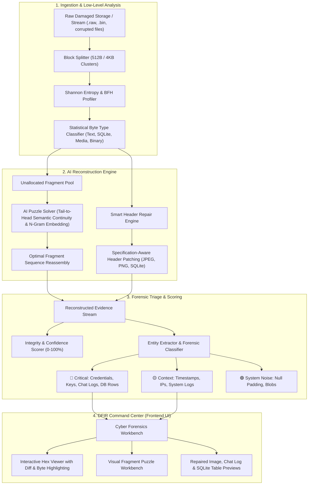

# ForensiX-AI: Intelligent Data Recovery & Evidence Reconstruction Engine

> **CALMSTACKS 24H HACKATHON // OFFICIAL PROBLEM STATEMENT**  
> **Track:** Cybersecurity & AI  
> **Title:** AI-Assisted Intelligent Data Recovery and Digital Evidence Reconstruction

---

## 1. Problem Statement & The Gap

Accidental deletion, filesystem corruption, damaged storage, ransomware incidents, and malicious attempts to destroy evidence can result in partial or complete loss of critical digital data.

### Why Traditional Tools Fail:
| Failure Point | Traditional Tools (PhotoRec, Scalpel, Recuva) | **ForensiX-AI Solution** |
| :--- | :--- | :--- |
| **Non-Contiguous Fragments** | Assume sequential blocks; fail or dump corrupt junk if a file is split across non-contiguous clusters. | **AI Jigsaw Fragment Solver:** Measures semantic boundary affinity, n-gram TF-IDF continuity, and chronological timestamp progression to solve fragment order. |
| **Corrupted / Wiped Headers** | Depend strictly on magic bytes (`\x89PNG`, `\xFF\xD8`, `SQLite format 3`). If overwritten by malware or zeroed, recovery fails completely. | **Smart Header Synthesizer:** Detects internal payload streams (IDAT, JFIF, DB B-Trees), rebuilds specification-compliant headers, and recalculates CRC32/parameters to make the file viewable. |
| **Unorganized Dump Overload** | Dumps thousands of unnamed files (`f00123.dat`) with zero context, leaving investigators overwhelmed. | **Forensic IOC Triage & Integrity Scoring:** Automatically extracts passwords, crypto wallets, and threat indicators, scoring integrity from 0–100% with cryptographic SHA-256 chain of custody. |

---

## 2. Technical Architecture



---

## 3. The 3 Deterministic Hackathon Demo Scenarios

ForensiX-AI includes 3 preloaded deterministic scenarios for instant, bulletproof live demonstrations:

### 🧩 Case 1: The Fragmented Threat Intel Leaks
- **Scenario:** A 3-part criminal extortion log containing breach confirmation, ransomware demands (Bitcoin wallet), decrypt keys, and Tor onion URLs scattered across non-contiguous disk clusters (`Cluster #104`, `Cluster #512`, `Cluster #942`) in scrambled order.
- **AI Action:** Solves the puzzle using NLP n-gram boundary continuity, dialog speaker turn-taking, and timestamp progression (`14:02:10` ➔ `14:03:15` ➔ `14:04:22`), achieving **95.2% confidence**.
- **Triage Result:** Extracts Bitcoin address `bc1qar0srrr...`, decrypt key `sk-live-...`, and `.onion` verification link.

### 🖼️ Case 2: The Broken Surveillance Evidence Photo
- **Scenario:** Critical surveillance CCTV evidence PNG photo where ransomware deliberately overwrote the first 64 bytes with null bytes (`0x00`) and random junk (`0xCC`). Photo viewers and carving tools crash on open.
- **AI Action:** Identifies internal `IDAT` compressed image streams, regenerates standard 8-byte PNG magic header (`89 50 4E 47 0D 0A 1A 0A`) + valid 13-byte `IHDR` chunk, and recalculates CRC32.
- **Visual Proof:** Hex Viewer highlights injected bytes in **emerald green** and damaged bytes in **rose red**. The surveillance image renders cleanly in the viewer.

### 🗄️ Case 3: Damaged SQLite Financial Ledger
- **Scenario:** A database table (`illicit_transfers`) recording money-laundering transactions where malicious actors zeroed the 100-byte SQLite header to obstruct forensic audit.
- **AI Action:** Injects standard 100-byte SQLite v3 header (page size 4096B, UTF-8 schema cookie), re-establishes B-tree table structures, and extracts unallocated database rows directly into structured tables.

---

## 4. Quick Start (1-Click Run)

### Method A: One-Click Unified Server (Recommended for Local Demo)
Double-click `run_demo.bat` or run:
```bash
run_demo.bat
```
This launches the FastAPI backend and serves the compiled React DFIR Command Center on **`http://localhost:8000`**, automatically opening your browser!

### Method B: Dual Dev Mode (Vite Hot-Reload)
```bash
run_dev.bat
```
- Backend API: `http://127.0.0.1:8000`
- Frontend UI: `http://127.0.0.1:5173`

### Method C: Deploy to Vercel (Cloud Deployment)
1. Fork or import this repository on [Vercel](https://vercel.com).
2. Vercel automatically detects the configuration from `vercel.json`:
   - **Frontend:** Builds the React/Vite app from `frontend/` to `frontend/dist`.
   - **Backend Serverless:** Routes `/api/*` to the Python FastAPI runtime via `api/index.py`.
3. Click **Deploy** — your live cloud forensics workbench is ready!

---

## 5. Automated Verification & Testing

To run the automated validation suite covering all algorithms, entropy calculations, and API endpoints:
```bash
python backend/test_engine.py
python backend/test_api.py
```

---

## 6. Judges Pitch Script (English & Kanglish)

### 30-Second Elevator Pitch (English):
> *"Honorable Judges, traditional data recovery tools only carve sequential files with intact headers. In real cyber incidents, ransomware corrupts headers and files are fragmented across non-contiguous clusters. ForensiX-AI is an intelligent forensic assistant that stitches non-contiguous fragments like a jigsaw puzzle using AI continuity models, reconstructs broken headers with specification-aware repair, and calculates a 0–100% integrity confidence score with a digital chain of custody."*

### Kanglish Pitch (Kannada + English):
> *"Sir, normal tools file header nodi matra recover madatte. But header corrupt agidre athava file 3 sectors nalli scatter agidre avakke agalla. Namma system AI embeddings use madi scattered pieces na puzzle thara stitch madatte, damaged PNG/SQLite header na fix madatte, and file ge 95% Confidence score kottu critical evidence (passwords, wallets) na highlight madatte."*

---

## 7. Deliverables Checklist

- [x] **Working Functional Prototype:** Full-stack Cyber Forensics Web Command Center with interactive Hex Dump, fragment puzzle workbench, and artifact preview.
- [x] **Demonstration on Corrupted/Fragmented Data:** 3 deterministic test scenarios covering fragmented logs, corrupted images, and damaged database pages.
- [x] **Technical Architecture Presentation:** Interactive slide deck embedded directly inside the UI (click *"Judge Presentation & Architecture"* in top bar).
